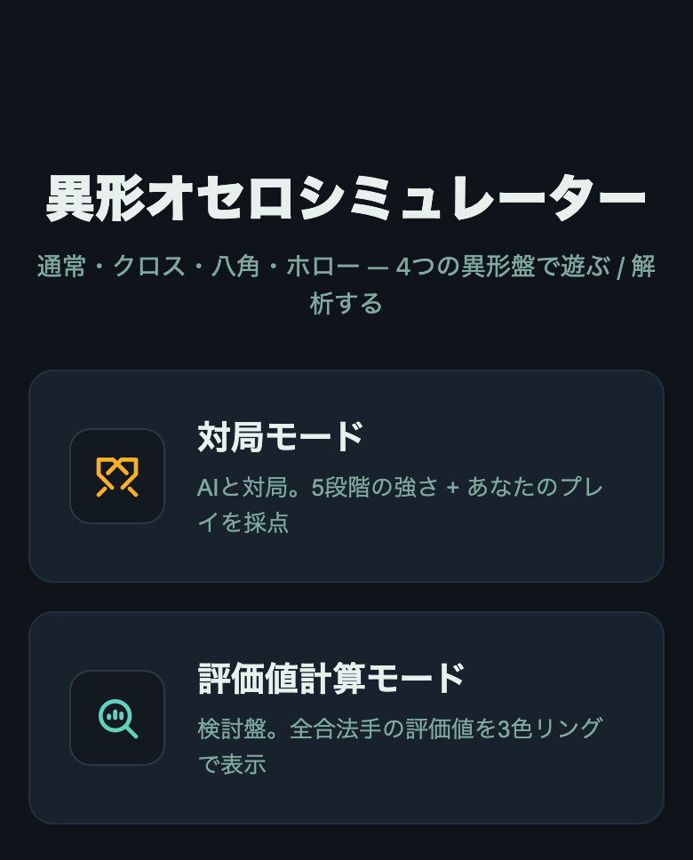
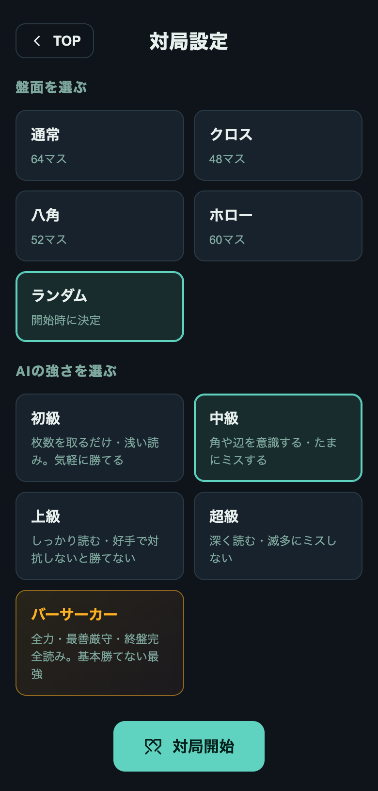
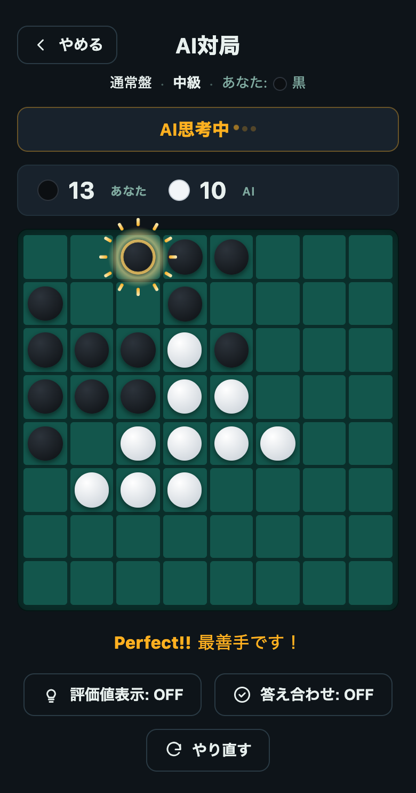
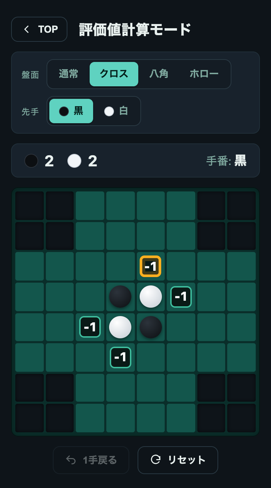

# 異形オセロシミュレーター

四隅の形が異なる変則盤を含む複数の盤面で、AI と対局したり、各局面の打てる手すべてに評価値を出して検討したりできるリバーシ(オセロ)の Web アプリ。

デモ: https://kozakikaoru.github.io/corner_cut_reversi_eval/

---

## 特徴

- **変則盤を含む複数の盤面に対応** — 通常の盤に加え、四隅の欠け方が異なる変則盤を、同じ操作感のまま切り替えて遊べる・調べられる。
- **強さを段階的に選べる対局 AI** — 初心者が気持ちよく勝てる弱さから、まず勝てない最強格まで、相手の手応えを選んで対局できる。
- **着手ごとの判定と対局後の採点** — 一手ごとに手の良し悪しをその場でフィードバックし、対局全体の出来をまとめて評価する。
- **打てる手すべてに評価値を出す検討モード** — その局面で着手できるマス全部に評価を出し、最善手・善手・悪手を色で直感的に示す。
- **スマートフォンでも快適なレスポンシブ設計** — 画面サイズに合わせて盤面と操作系が収まり、重い思考の最中も操作が固まらない。

---

## 画面イメージ

| メニュー | 対局設定 | 対局 | 検討 |
|---|---|---|---|
|  |  |  |  |

---

## 技術スタック

| レイヤー | 採用技術 |
|---|---|
| 言語 | TypeScript(strict) |
| ビルド / 開発 | Vite |
| UI | 素の DOM(UI フレームワークなし) |
| 並行処理 | Web Worker |
| テスト / 検証 | Node 実行のエンジン検証・自己対局ベンチ |
| 配信 / CI | 静的サイト(GitHub Pages・GitHub Actions で自動デプロイ) |

---

## ローカル起動方法

```bash
# 1. 依存をインストール
npm install

# 2. 開発サーバー起動
npm run dev
# → http://localhost:5180
```

API キーや環境変数は不要。インストール後すぐに、メニューから対局・検討の両モードが動く。

> Node.js は 18+ / 20+ 推奨(Vite 5 の要件)。

---

## コマンド一覧

```bash
npm run dev          # 開発サーバー
npm run build        # 本番ビルド(静的ファイルを dist/ へ出力)
npm run preview      # 本番ビルドをローカル配信
npm run typecheck    # tsc --noEmit
npm run check:engine # 盤面ロジック・探索の自動検証
npm run bench:eval   # 評価関数の精度ベンチ(完全読みを正解とした着手ロス)
npm run bench:ab     # 評価関数の新旧を自己対局させ勝率を比較
npm run bench:ladder # AI 各段階の強さ(対人間モデルの勝率)を検証
```

---

## ディレクトリ構成(抜粋)

```
src/
├ engine/                # 盤面ロジック + 探索エンジン(盤面非依存)
│  ├ types.ts            # 盤面プリセット(欠けマス集合)・基本型
│  ├ board.ts            # 合法手 / 反転 / パス / 終局
│  ├ evaluate.ts         # 中盤評価(マス重み・機動力・開放度ほか)
│  ├ search.ts           # negamax + αβ + 置換表 + 反復深化 + 終盤完全読み
│  └ zobrist.ts          # 置換表用ハッシュ
├ worker/                # 評価を別スレッドで走らせる Web Worker 一式
├ game/                  # 対局状態・対局 AI・採点
│  ├ ai.ts               # 対局 AI(強さの設計)
│  └ scoring.ts          # 着手判定・最終プレイ採点
└ ui/                    # メニュー / 対局 / 検討 の各画面(素の DOM)
scripts/                 # エンジン検証・各種ベンチ(ビルド外)
public/                  # favicon 等の静的アセット
```
